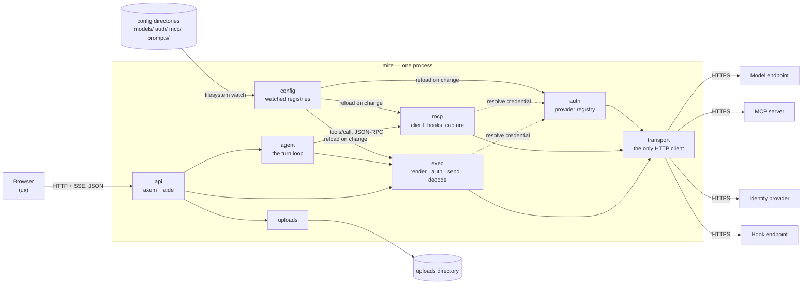
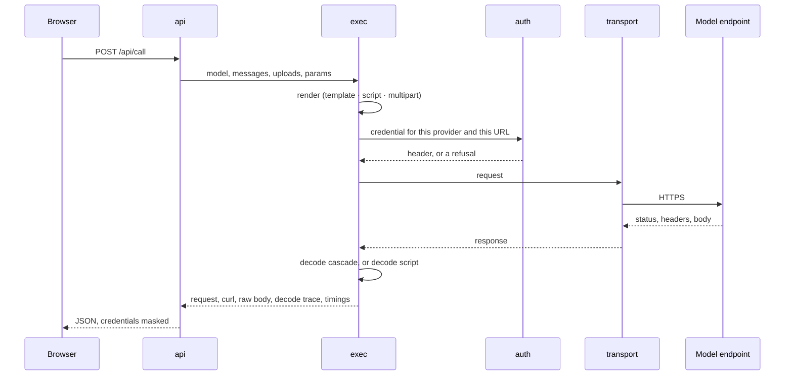

# Architecture

## Overview

`mire` is one process. It serves a React UI and an HTTP API on loopback, reads
its endpoints, credentials, MCP servers and saved prompts from directories of
YAML files, and makes every outbound call itself — to the model endpoint under
test, to the MCP servers a run reaches, to an identity provider, and to whatever
a hook points at.

Nothing is deployed for anybody else, nothing is stored between runs, and the
browser never talks to a model endpoint directly. That last one is the shape the
rest of the design follows from: the calls originate in the process, so there is
no CORS to negotiate, a workload identity is testable because the credential
never has to reach a tab, and there is exactly one place where a credential can
leak.

## Components

Each of these is a module under [`src/`](src/), named here exactly as it is
named there.

**[`cli`](src/cli.rs) and [`settings`](src/settings.rs)** resolve every option
three ways — a flag, an environment variable, a key in `mire.yaml` — and settle
the precedence between them. They own startup configuration only; nothing they
produce changes while the process runs.

**[`config`](src/config.rs)** holds the hot-reloading view of the configuration
directories, and [`config::layout`](src/config/layout.rs) says what a directory
holds and how each kind is read out of it. It watches every listed directory and
swaps the registries together. It owns no file format of its own: the loaders do.
[`config::stage`](src/config/stage.rs) is the one exception, and it is a
pre-pass rather than a format: it reads a file once per environment the file
declares, substituting `${ stage.… }` before the loader sees a document.

**[`model`](src/model.rs)** and [`model::loader`](src/model/loader.rs) turn
`models/` into a registry of endpoints. The file on disk is the source of truth
and is only ever read; a file that does not load is skipped and reported rather
than fatal.

**[`auth`](src/auth.rs)** is the credential registry — [`token`](src/auth/token.rs),
[`oidc`](src/auth/oidc.rs) (`client_credentials`), [`browser`](src/auth/browser.rs)
(authorization code with PKCE) and [`anonymous`](src/auth/anonymous.rs), behind
one [`registry`](src/auth/registry.rs). It answers "what credential, and where
does it go" and nothing else; it never decides *whether* a call happens.
[`session`](src/auth/session.rs) holds browser logins outside the registry,
because the registry is rebuilt from scratch on every reload and a signed-in user
must survive an edit to an unrelated file.

**[`render`](src/render.rs)** turns a model plus some input into a concrete
request: a MiniJinja template, a Rhai script, or a `multipart/form-data` form.
It produces a request; it does not send one.

**[`exec`](src/exec.rs)** runs one call end to end — render, authenticate, send,
decode — and returns everything a caller needs to reproduce it elsewhere,
`curl` equivalent included.

**[`decode`](src/decode.rs)** normalises whatever came back:
[`chat`](src/decode/chat.rs), [`embedding`](src/decode/embedding.rs),
[`error`](src/decode/error.rs) and [`stream`](src/decode/stream.rs), resolved
either by cascading [`paths`](src/decode/paths.rs) or by a
[`script`](src/decode/script.rs). Decoding never fails a call: a miss is a trace
entry beside the raw body.

**[`agent`](src/agent.rs)** is the turn loop. It owns the stop conditions and the
named outcomes, and answers the model's tool calls either from a model's own
simulated `tools:` or from a real server through `mcp`.

**[`mcp`](src/mcp.rs)** is the client half of the Model Context Protocol:
[`negotiate`](src/mcp/negotiate.rs) settles the revision,
[`client`](src/mcp/client.rs) speaks the Streamable HTTP transport for all four
of them, [`auth`](src/mcp/auth.rs) and [`headers`](src/mcp/headers.rs) decide who
`mire` is to a server, [`hook`](src/mcp/hook.rs) fires around a `tools/call`, and
[`capture`](src/mcp/capture.rs) reads variables out of a result into
[`vars`](src/vars.rs).

**[`transport`](src/transport.rs)** is the only place that builds an HTTP client
or sends a request. Everything above goes through it, which is what makes "a
credential never survives a cross-host redirect" an invariant with one
implementation rather than four.

**[`redact`](src/redact.rs)** is the other choke point: a `Secret` that cannot be
printed by accident, and a `Redactor` that scrubs values something else copied —
an upstream error body quoting the token back, a rendered request line, a trace.

**[`api`](src/api.rs)** is the axum router and the `aide`-generated OpenAPI
document, with wire shapes in [`dto`](src/api/dto.rs) kept deliberately separate
from the domain types, shaping-only [`handlers`](src/api/handlers.rs), the
[`sse`](src/api/sse.rs) responses, and [`ui`](src/api/ui.rs), which serves the
embedded front end and rewrites its base URL under a path prefix.

**[`uploads`](src/uploads.rs)** is the one component that writes to disk.

**[`ui/`](ui/)** is a React + TypeScript front end, built by Vite and embedded
into the binary. It renders what the API returns and holds the conversation; it
has no model of its own and edits no configuration.

## Data flow

### One call

`POST /api/call` is the whole tool in a straight line, and every other path is
this one repeated or split into events.

The model names its credential, so the provider is resolved after the request is
rendered and against the URL the request will actually use — a templated URL
resolves first, so `allowed_hosts` is checked against the address that will be
dialled rather than the one the file was written with. The endpoint's status is
recorded, never consulted: a `4xx` from the endpoint under test is a successful
call, and only `mire` failing at its own job is an API error.

### A run

`POST /api/agent` wraps that in the loop and streams it. Before the first turn,
each MCP server the run reaches is negotiated, handshaken and asked for its
tools; that setup is reported as its own event, because a run that dies
negotiating never reaches a turn to report it on.

Each turn renders and calls exactly as above. A tool call is answered either by a
model's simulated `tools:` — deterministic, executing nothing — or by a real
server, in which case `before` hooks fire, the `tools/call` goes out, capture
rules read variables out of the result, and `after` hooks fire with those
variables already in scope. A tool that reports a problem is a result, fed back
to the model; only a call that could not be answered at all is an error of
`mire`'s own.

The loop ends on a named outcome — a stop predicate held, the iteration budget,
the deadline, a repeated call, or a predicate that could never be evaluated
once — and appends only the answer it finished on to the conversation. The tool
calls in between stay out of the history: replaying them into the next request
without their results is how a working endpoint starts answering `400`.

### Signing in

A browser provider is the one flow that leaves the process and comes back. The
UI computes the callback from `document.baseURI` and sends it with the login
request, because nothing inside the process can derive the browser's origin from
the socket it bound — behind a notebook proxy those are different addresses.
`--public-url` overrides it where a proxy rewrites paths. The tokens stay in
`auth::session`; the browser is told a username, the granted scopes and an
expiry, never a token.

## State and persistence

There is no datastore, and there is no session on the server beyond a browser
login.

- **The configuration directories** are the only durable input. They are read,
  watched and reloaded; they are never written to. The last directory to declare
  a name owns it, so a read-only shared layer plus a private one on top is the
  intended arrangement rather than a workaround.
- **The uploads directory** is the only durable output, and the only thing
  `mire` writes. It is created on the first attachment rather than at startup,
  which is what keeps a read-only container correct for everybody who never
  attaches anything. Nothing is ever overwritten and nothing is deleted.
- **Browser login sessions** live in memory, outside the auth registry so a
  configuration reload does not sign anybody out. They end with the process.
- **Captured variables** are one bag per run, shared across every server that run
  reaches, thrown away with the run.
- **The conversation and the traffic** live in the browser tab, not here. The tab
  also remembers small settings — the selected model, a half-typed message, the
  turn budget, which servers are off — in browser storage. A credential is never
  among them.

## Design decisions

**The conversation is the request.** The whole history travels in the body of
every call, so there is nothing to expire and nothing to resume. This is what
makes *Copy as curl* honest: the command for turn five reproduces turn five,
tomorrow, on a machine that never had the tab open. A server-side conversation
would buy convenience and turn that button into a lie.

**Configuration is input, not part of the tool.** Endpoints, credentials, servers
and prompts are files you own, and the UI is read-only over them. A button that
wrote into a configuration directory would produce endpoints nobody can review,
commit or hand to a colleague — and would cost the container its read-only
filesystem. Editing happens in your editor; the watcher picks it up.

**A broken file under test is a finding; a broken options file is fatal.** One
malformed model or provider is skipped, reported on the API's `issues` list, and
takes nothing else down: you reach for this tool when something is already
wrong, so it must come up and show you what. `mire.yaml` gets the opposite
treatment, because it is the tool's own wiring — a `port:` that did not parse
means listening somewhere nobody asked for, and a misspelled key means a setting
you believe is in effect and is not.

**A stage is an expansion, not a lookup.** The same endpoint at three addresses
is one file declaring `stages:`, expanded once per stage at load — so `prod` is a
whole entry with its URL parsed, its JSONPaths compiled and its header names
checked, and a typo in it is a startup issue rather than something the afternoon
somebody first picks prod. Resolving a stage at call time would have been less
code and would have moved every one of those checks to the first call.

The substitution is spelled `${ … }` because the file already holds `{{ … }}`
for the request template, and the two are resolved at different moments against
different contexts: `${ stage.served_model }` when the file loads, seeing only
that stage's variables, and `{{ messages | tojson }}` when a call goes out. A
file that declares no `stages:` is not substituted at all, which is what keeps a
`${` somebody typed a `${` they typed.

An entry is then addressed as `name@stage`, and a bare name is its default stage.
Stages are per entry and independent across kinds — a `prod` model, a `preprod`
credential and a `dev` server is an ordinary run — because the whole point is to
vary one axis while holding the others still.

**Declarative first, script as an escape hatch.** A `decode:` field is a cascade
of JSONPaths tried in order, which covers endpoints that disagree with each other
and endpoints that disagree with their own previous version. A Rhai script is
available for what a path cannot express — stripping a `<think>` block, computing
something — and is deliberately awkward to prefer: it is code in a config file,
harder to read and harder to review. `template`, `script` and `multipart` are
mutually exclusive, as are `decode` paths and `decode.script`, so there is no
precedence rule to remember and no ambiguity about which body went out.

**The endpoint's status is never used to decide whether it failed.** A gateway
that swallows an upstream failure and answers `200` with the complaint in the
body is precisely the mismatch worth catching, so `decode.error` is read
regardless of status. The rule runs the other way too: a cascade finding nothing
under a `2xx` is not a miss, because there was nothing to find.

**Simulated tools are the default; real ones are opt-in per file.** A simulated
tool proves the model emits well-formed calls and knows what to do with a result,
executing nothing. A live MCP tool is the one thing here with effects outside the
process, so declaring the server is the deliberate act — and `hooks:` exist
because somebody else usually wants to know when it happens. Which servers a
given run reaches only ever narrows what the files declare.

**The MCP revision is settled by asking, and the answer says how.** `mire` probes
newest-first and falls back to assuming the newest when neither probe answers,
because `server/discover` is a method a perfectly good server may not implement
and failing there would break working endpoints to report a problem they do not
have. What matters is that the settling method is reported: a run that worked
because a guess happened to be right is a different fact from one that worked
because both ends agreed, and only one of them stays true next week.

**Credentials are held by reference and masked on the way out.** `auth/` says
where to look — an environment variable, a file re-read on every call, an OIDC
exchange, a browser session — so the directory is safe to commit. Two mechanisms
enforce the rest: a `Secret` type that cannot be printed by accident, and a
`Redactor` over everything that leaves the process, for the cases where somebody
else copied the value first. A credential typed into the UI stays in that tab;
one `mire` fetched never reaches the tab at all.

**An undefined template variable is an error.** `Authorization: Bearer ` is a
header that looks present, passes every local check, and fails at the far end
with something unhelpful. The one exception is a hook's `if:`, which is *asking*
whether something is there and has to be able to hear "no".

**Everything compiles at load time.** Templates, Rhai scripts, JSONPaths and the
regexes behind `tools:` are all parsed when the file is read, so a typo names the
file at startup instead of surfacing twenty minutes into a run — or, worse,
rendering beautifully into a URL that is quietly the wrong one.

**Vectors are never rendered whole**, in the logs, the API or the UI: a width, an
L2 norm, a sample and a histogram. A careful summary sitting next to a `raw`
field carrying all 1024 floats would be theatre, so the raw node is elided too.
`includeVectors` is the only way to get the payload.

**The artefacts are a static binary and a `distroless/static` image.** The UI is
embedded, so there is one thing to copy and no assets to serve from anywhere
else. The image carries a certificate bundle, timezone data and `/etc/passwd` —
no shell, no package manager, nothing to patch — runs as UID 65532 and writes
nothing, so a read-only filesystem costs nothing. It ships no `HEALTHCHECK`
because it holds no HTTP client to run one with; `/healthz` is the same check,
run by something that already has one.

## Invariants and constraints

- **A credential value never leaves the process**, in an API response, a log
  line, a trace, or a `curl` export. Tests fail when one appears, including when
  the endpoint or the identity provider quotes it back in an error message.
- **A credential never survives a cross-host redirect.** There is one HTTP client
  so that this has one implementation.
- **`allowed_hosts` is checked against the resolved URL**, after a templated URL
  has been rendered, and before anything goes out.
- **The model registry and the auth registry swap together**, so a call never
  sees a new model against an old credential.
- **A `4xx` or `5xx` from the endpoint under test is a successful call.** The API
  returns an error only when `mire` could not do its job.
- **An uploaded file name is a display name, never a path.** It is reduced to its
  last segment and sanitised, so nothing a client sends can write outside the
  upload directory, and every stored name carries a random prefix so nothing is
  overwritten.
- **Rhai scripts have no file, network or process access**, `eval` is disabled,
  and every run is bounded — operations, wall clock, and string, array and map
  sizes. A test asserts it stays that way.
- **Nothing renders untrusted markup.** The UI builds React elements from an
  answer's markdown rather than an HTML string, so `dangerouslySetInnerHTML`
  never sees a document written by the thing under test.
- **Every way out of the loop is named**, including the one where a stop
  predicate could never be evaluated — otherwise a model whose endpoint reports
  no finish reason looks like a slow agent rather than a mismatch.
- **The last configuration directory to declare a name owns it**, per kind, and
  the shadowing is logged. Two files in the *same* directory claiming one name is
  a load issue, and the first one keeps the name. A name is displaced whole: the
  stages of the file that held it go with it rather than surviving beside the
  ones replacing it.
- **A file's stages load together or not at all.** One that does not expand takes
  the entry with it, so a stage missing from the picker is never explained only
  by a line in the log.
- **A stage is an identity of its own.** Two stages of one credential hold two
  token caches and two browser sessions, and two stages of one MCP server
  negotiate and keep two sessions — they share a file, and nothing else.

## Limitations

- **A tool call split across chunks is not reassembled.** The `tool_calls`
  cascade runs on every chunk, so an endpoint that sends a call whole — in the
  last chunk or any other — decodes streamed exactly as it does unstreamed. One
  that fragments a call's arguments across chunks, as the `OpenAI` shape does,
  comes back looking like a turn that asked for nothing. Stitching those
  fragments would be guesswork; the run is honest about it instead, and
  streaming is off by default.
- **MCP is Streamable HTTP only.** There is no stdio transport, so a server that
  is a local subprocess has to be fronted by something that speaks HTTP.
- **A server asking for interactive input stops the tool.** An elicitation needs
  somebody to ask, and a harness has nobody; the call comes back naming what was
  wanted.
- **Hook actions are HTTP.** The kind is the key an action is written under, so
  another one is an addition rather than a break, but today `http:` is the only
  one.
- **Nothing survives the tab.** The conversation and the traffic are lost when it
  closes; *Export* is the way to keep a run, and it is built in the page because
  the page is the only place a run exists as a whole.
- **Released binaries are Linux only**, statically linked against musl. Other
  platforms build from source.
- **Annotations are reported, never enforced.** `readOnlyHint` and
  `destructiveHint` are a server's claim about itself, and checking claims is the
  job; `tools:` is the mechanism when a server must be narrowed.
